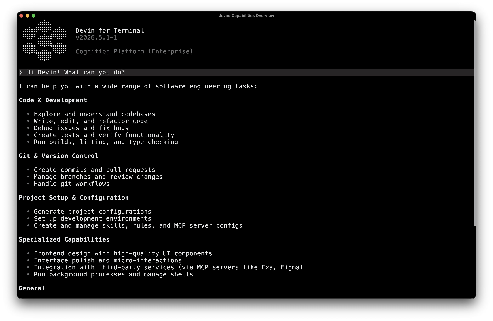

<Steps>
  <Step title="Install Devin for Terminal">
    <Tabs>
      <Tab title="macOS / Linux / WSL">
        ```bash
        curl -fsSL https://cli.devin.ai/install.sh | bash
        ```
      </Tab>
      <Tab title="Windows">
        Download and run the installer:

        - [x86_64 (most Windows PCs)](https://static.devin.ai/cli/devin-updater-x86_64-pc-windows.exe)
        - [ARM64 (Windows on ARM)](https://static.devin.ai/cli/devin-updater-aarch64-pc-windows.exe)

        Alternatively, open **PowerShell** and run:

        ```powershell
        irm https://static.devin.ai/cli/setup.ps1 | iex
        ```

        <Warning>
          `irm` and `iex` are PowerShell commands. Do not run this in Git Bash or CMD — it will fail with "command not found". Use PowerShell for installation only.
        </Warning>

        After installing, you can use Devin for Terminal from either **Git Bash** or **Windows Terminal**.
      </Tab>
      <Tab title="Windsurf (Enterprise)">
        Devin for Terminal is bundled with **Windsurf** starting with version **1.9577.24**. This installation method is available for **Windsurf Enterprise** and **Devin Enterprise** plans.

        **Admin setup:** For the Windsurf-bundled install, an admin must first enable the install option in Devin for Terminal team settings by toggling on **Show "Install Devin for Terminal" in the Windsurf Command Palette**.

        **User installation:**

        1. Open Windsurf (version 1.9577.24 or later)
        2. Open the Command Palette with <code>Cmd+Shift+P</code>
            (macOS) or <code>Ctrl+Shift+P</code>
            (Windows/Linux)
        3. Search for and run **Install Devin for Terminal**

        This adds the `devin` binary to your PATH so you can use it from any terminal.
      </Tab>
    </Tabs>
  </Step>
  <Step title="Start coding">
    That's it! After you restart your terminal, enter a project directory and type `devin` to activate Devin for Terminal. Also try preloading the session with a prompt for automation:

    ```bash
    devin -- check out this code and suggest a feasible, helpful feature
    ```

    <Check>
      You're ready to go. For must-know tips, see [Essential Commands](/essential-commands).
    </Check>
  </Step>
</Steps>

## What's next?

Devin for Terminal can implement new features, fix bugs, review code, answer questions, automate tasks, and more.

<CardGroup cols={2}>
  <Card title="Essential Commands" icon="terminal" href="/essential-commands">
    Must-know commands and slash commands
  </Card>

  <Card title="Models" icon="brain" href="/models">
    Choose the right model for your task
  </Card>

  <Card title="Extensibility" icon="puzzle-piece" href="/extensibility/index">
    Connect MCP servers and skills
  </Card>

  <Card title="Command Reference" icon="book" href="/reference/commands">
    Explore all commands and flags
  </Card>
</CardGroup>

---

## Devin for Terminal vs. Devin

Devin for Terminal and [Devin](https://docs.devin.ai/) are separate tools designed for different workflows.

**Devin for Terminal** is a local coding agent that runs directly in your terminal. It works with your local files and environment, giving you fast, interactive assistance right where you code.

**Devin** is our cloud-based AI software engineer that runs in a virtual machine. It includes features like Playbooks, Secrets, Knowledge, and other capabilities that are not available in Devin for Terminal.

<Info>
  Devin for Terminal does not yet support Knowledge, Playbooks, or Secrets from your Devin account. We're actively working on adding support for each of these and plan to roll them out soon.
</Info>


